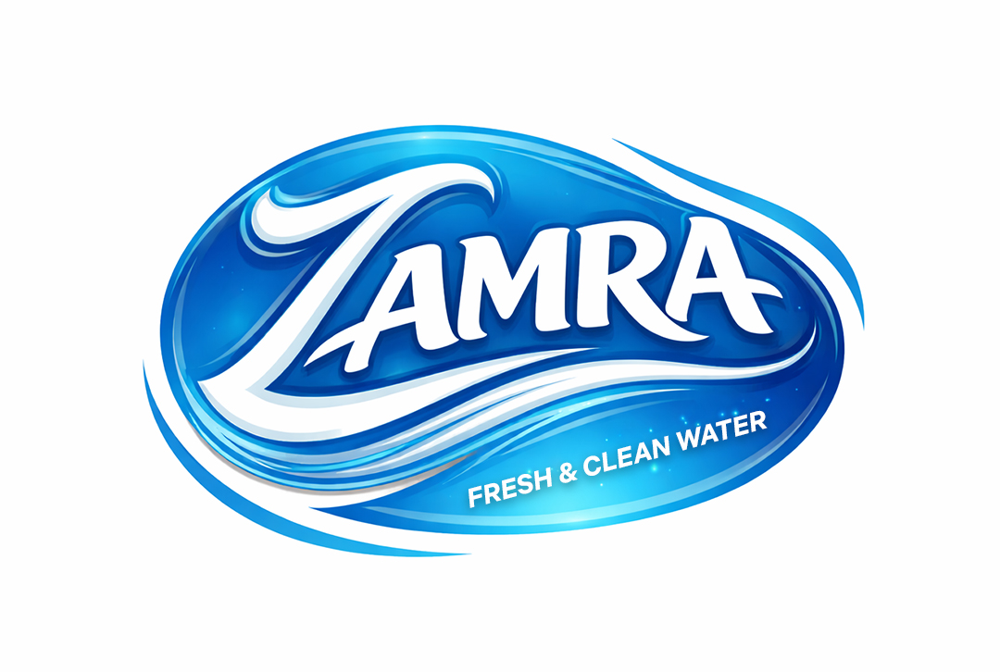

# Zamra Water Plant Admin Dashboard

A **Next.js** admin dashboard for **Zamra Water Plant**, built with **React**, **Tailwind CSS**, and **Lucide Icons**, to manage daily operations, generate reports, and track plant data efficiently.

---

## 🚀 Features

- **Real-time Plant Data**: Monitor water production, filtration units, and delivery status.
- **Daily PDF Reports**: Generate downloadable reports for sales, deliveries, and invoices.
- **WhatsApp Notifications**: Send daily reports and bills to stakeholders directly.
- **Secure Admin Login**: Only authorized personnel can access the dashboard.
- **Responsive Design**: Fully optimized for desktop, tablet, and mobile devices.
- **Modern UI Components**: Input fields, buttons, and status panels styled with Tailwind CSS and Lucide Icons.

---

## 📂 Project Structure
app/
├─ page.tsx # Main login/dashboard page
├─ globals.css # Tailwind + global styles
components/
├─ AdminLogin.tsx # Admin login form
├─ inputFields/ # Custom input field components
├─ button/ # Reusable button components
public/
├─ Logo.jpg # Zamra Plant logo & favicon

# 🛠 Usage
Login as an admin using authorized credentials.
Monitor Plant Status: Check filtration units and water production.
Generate Reports: Download daily PDF reports for operations and sales.
Send WhatsApp Notifications: Automatically send daily reports or bills.
Manage Deliveries: Track delivery schedules and statuses.

# 🌐 Technologies Used
Next.js
 – Server-side rendering and React framework
React
 – Frontend library
Tailwind CSS
 – Utility-first CSS framework
Lucide Icons
 – Icon library
Google Fonts
 – Geist and Geist Mono fonts